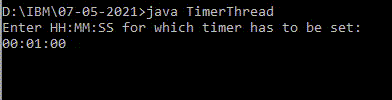
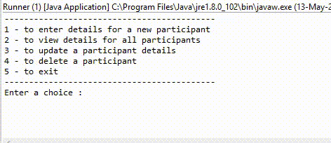
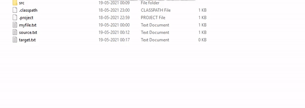

# Exercises

- ___Week of April 30___
    - To run, download package weekofapr30, go to directory parent to weekofapr30 and open a terminal at this location.
    - Enter command ```javac weekofapr30/SolutionsRunner.java```
    - Enter command ```java weeekofapr30.SolutionsRunner```
    - A user interface will appear to guide for the steps, proceed as required.
    - File [weekofapr30/ExercisesDescription.txt](https://github.com/AshGaur/Java-FSD-Assignments/tree/main/Exercises/weekofapr30/ExercisesDescription.txt) has list of all exercises included.
    
- ___May 05___
    - Method to reverse and check if input string is palindrome. `may05/StringReverseAndPalindrome.java`
    - Own implementation of split method from java.util.String. `may05/MyOwnSplitMethod.java`
    - Use methods from java.lang.String and this class to do exercises from [may05/Lab-Strings.png](https://github.com/AshGaur/Java-FSD-Assignments/tree/main/Exercises/may05/Lab-Strings.png). `may05/Assignments2.java`

- ___May 07___
    - Display Timer on console. `may07/TimerThread.java`
     
     
    - Display Random number between 1000 and 9999 without using inbuilt random methods. `may07/RandomNumber.java`

- ___May 10___
    - Exercises problem statement are defined in [may10/JavaLabWork1.pdf](https://github.com/AshGaur/Java-FSD-Assignments/tree/main/Exercises/may10/JavaLabWork.pdf).
    - Lab1 Make required classes hierarchy,members and methods as described in problem statement. `may10/library`
    - Exercises 1,2,3 trafficSimulator,nthFibonacci,primesPrinter. `may10/Exercises123.java`
    - Custom Exception on given conditions Exercise 4,5. `may10/ValidateUser.java`
    - Custom Exception in package com.cg.eis.exception exercise 6. `may10/com/Exercise6.java`

- ___May 12___
    - Use a suitable collection and create a continous menu-driven program to serve the problem statement explained in [may12/ProblemStatement.png](may12/ProblemStatement.png) `may12/Runner.java`
    
    
- ___May 14___
    - Added Project lombok Annotations to write cleaner code. `may12/Partcipant.java`
    - Added option at menu command 6 to get sorted by data by available parameters i.e. ID,Skills,Firstname,Lastname by using Comparator interface and compare method.
    - Added code to avoid duplicates by using HashSet, and overridden methods hashCode and equals methods.
    - Opimized verbose code to make it look a little cleaner.

- ___May 18___
    - Exercies problem statement can be seen in [may18/FileIO.png](may18/FileIO.png)
    - Print data from file with line numbers. `may18/FileDataLineNumber.java`
    - Print number of characters,words and lines from the text in a file. `may18/NumberOfCharsWordsLines.java`
    - Read filename and display File details. `may18/FileDetailsWithName.java`
    - Copy from source to target file using thread by copying 10chars at a time. `may18/FileProgram.java`
    